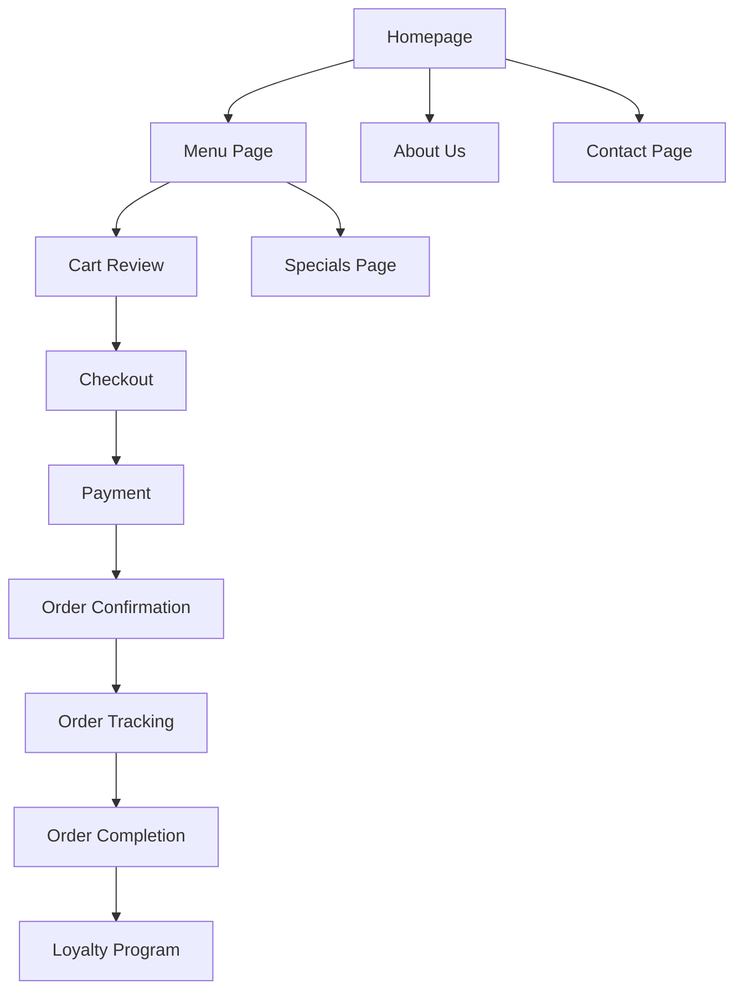

## 1. Product Overview
Triple D's Streetfood delivers bold, culturally rich flavours from Durban's legendary street food scene through a contemporary, accessible restaurant experience. The website serves as the digital storefront enabling customers to order authentic Durban street food online for delivery, pickup, or dine-in reservations.

The platform targets food lovers in Phoenix, Durban seeking authentic local cuisine with convenient ordering options, positioning Triple D's as the go-to destination for quality street food in the region.

## 2. Core Features

### 2.1 User Roles
| Role | Registration Method | Core Permissions |
|------|---------------------|------------------|
| Guest User | No registration required | Browse menu, place orders as guest |
| Registered Customer | Email/Social media registration | Order history, loyalty points, saved addresses, favorites |
| Admin | Backend admin panel access | Manage menu, orders, specials, content |

### 2.2 Feature Module
The website consists of the following essential pages:

1. **Homepage**: Hero section with signature dishes, value proposition, CTAs for ordering, daily specials preview, customer testimonials
2. **About Us**: Brand story, mission & vision, core values, team/restaurant photos
3. **Menu**: Categorized food items with descriptions, prices, dietary tags, add-to-cart functionality
4. **Specials**: Weekly/monthly specials, seasonal offerings, combo deals with expiration dates
5. **Ordering System**: Cart, checkout, payment processing, order tracking, pickup/delivery scheduling
6. **Contact & Locations**: Address, hours, phone, email, embedded map
7. **Loyalty**: Points program, referral incentives, newsletter signup

### 2.3 Page Details
| Page Name | Module Name | Feature description |
|-----------|-------------|---------------------|
| Homepage | Hero Section | Display signature dish photography with automatic image rotation, value proposition text, primary "Order Now" and secondary "View Menu" CTAs |
| Homepage | Feature Blocks | Quick links to ordering options (Dine-In, Pickup, Delivery), daily specials carousel, customer testimonials slider |
| About Us | Brand Story | Present company background, mission, vision, and core values with team/restaurant imagery |
| Menu | Category Navigation | Organize items into: Curries & Bunny Chow, Seafood, Street Classics, Sides & Add-Ons, Desserts, Drinks |
| Menu | Item Display | Show title, description, price, dietary tags (Spicy, Vegetarian, Gluten-Free), high-quality food photography |
| Menu | Cart Functionality | Add-to-cart buttons, sticky cart panel, quantity controls, running total display |
| Menu | Filters | Filter by dietary preferences, spice level, price range with real-time results |
| Specials | Current Offers | Display weekly/monthly specials, seasonal items, combo deals with clear pricing and expiration dates |
| Ordering System | Cart Management | View selected items, modify quantities, remove items, calculate totals with delivery fees |
| Ordering System | Checkout Process | Guest checkout option, account creation, address validation, payment gateway integration, tip option |
| Ordering System | Order Tracking | Real-time order status updates, estimated preparation/delivery times, SMS/email confirmations |
| Contact | Location Details | Display address, phone, email, business hours for dine-in/pickup/delivery, embedded Google Maps |
| Loyalty | Rewards Program | Points accumulation per order, tier benefits, referral bonuses, points redemption options |
| Loyalty | Newsletter | Email capture for specials announcements, new menu items, events notifications |

## 3. Core Process

### Customer Ordering Flow
1. Customer lands on homepage and views hero section with signature dishes
2. Customer clicks "Order Now" CTA or navigates to Menu page
3. Customer browses menu categories and filters items by preferences
4. Customer adds items to cart with quantity specifications
5. Customer proceeds to checkout, selects pickup/delivery option
6. Customer enters delivery address or selects pickup time
7. Customer completes payment through integrated gateway
8. Customer receives order confirmation with tracking information
9. Customer receives order completion notification

### Loyalty Program Flow
1. Customer registers account during or after ordering
2. System automatically adds loyalty points for completed orders
3. Customer views points balance and available rewards
4. Customer redeems points for discounts or free items
5. Customer refers friends to earn bonus points

## 4. User Interface Design

### 4.1 Design Style
- **Primary Colors**: Deep red (#D32F2F) for energy and appetite stimulation, warm orange (#FF6F00) for warmth, cream (#FFF8E1) for background
- **Secondary Colors**: Dark charcoal (#212121) for text, fresh green (#4CAF50) for success states
- **Button Style**: Rounded corners with subtle shadows, hover effects with color transitions
- **Typography**: Bold, modern sans-serif (Montserrat/Poppins) for headers, clean readable font (Open Sans) for body text
- **Layout**: Card-based design with generous whitespace, mobile-first responsive grid
- **Icon Style**: Custom food-themed icons, vibrant and appetizing visual elements

### 4.2 Page Design Overview
| Page Name | Module Name | UI Elements |
|-----------|-------------|-------------|
| Homepage | Hero Section | Full-width banner with parallax scrolling effect, overlay text with drop shadow, animated CTA buttons with pulse effect |
| Homepage | Feature Blocks | Three-column grid on desktop, single column on mobile, hover animations, icon-based visual cues |
| Menu | Category Cards | Horizontal scrolling on mobile, grid layout on desktop, category icons with food imagery |
| Menu | Item Cards | Square format with rounded corners, price badges, dietary tags as colored chips, add-to-cart button with quantity stepper |
| Specials | Offer Cards | Time-sensitive design with countdown timers, prominent discount percentages, limited availability indicators |
| Ordering | Cart Panel | Slide-out drawer on desktop, bottom sheet on mobile, real-time total updates, progress indicator |
| Contact | Location Info | Clean card layout with icon-text pairs, embedded map with custom marker, operating hours in table format |

### 4.3 Responsiveness
- **Desktop-first approach** with breakpoints at 1200px, 768px, and 480px
- **Mobile optimization** with touch-friendly buttons, swipe gestures for carousels
- **Tablet adaptation** with two-column layouts and optimized touch targets
- **Loading states** with skeleton screens for better perceived performance

### 4.4 Visual Enhancements
- **Hero animations**: Slow-zoom on food photography, fade-in text animations
- **Micro-interactions**: Button hover states, cart item additions with particle effects
- **Loading animations**: Custom food-themed loaders (rotating curry pot, sizzling pan)
- **Scroll effects**: Parallax backgrounds, fade-in elements on scroll