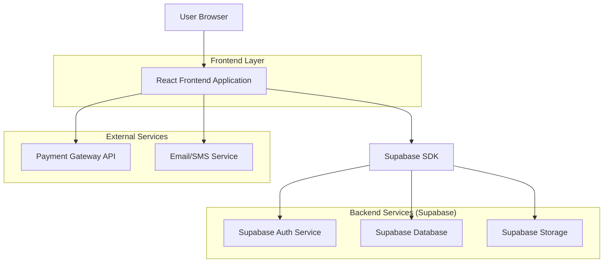
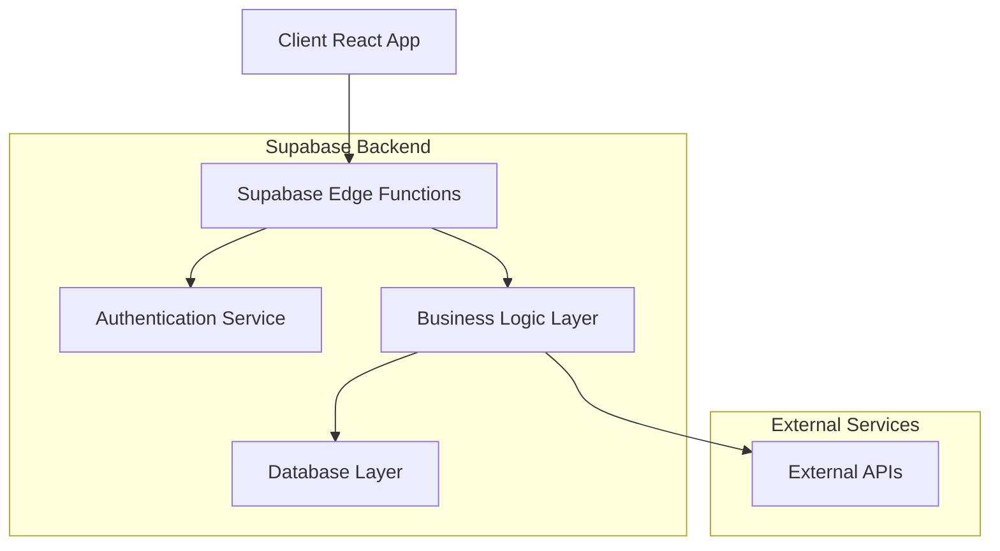
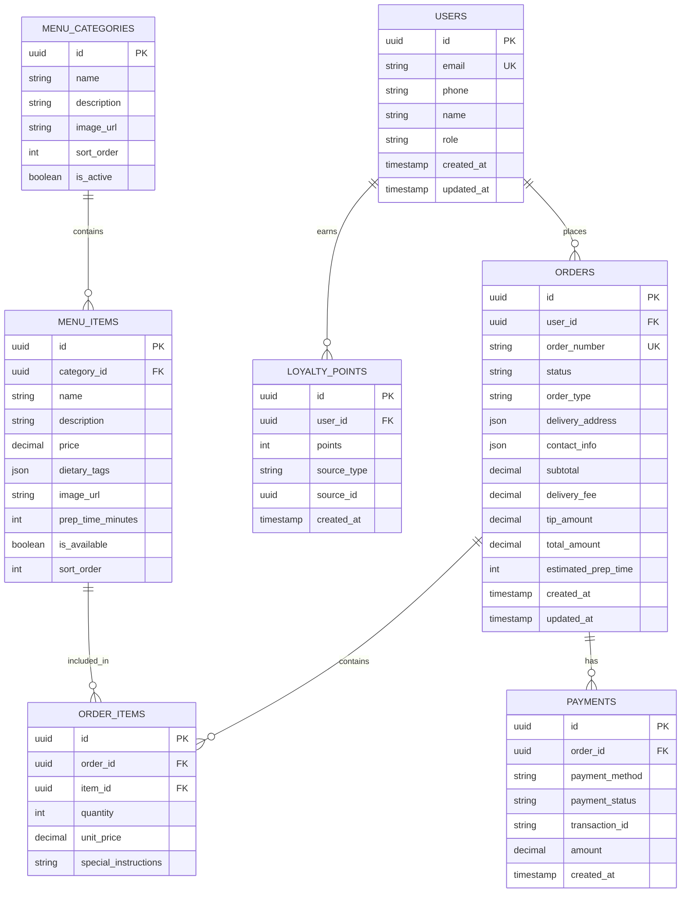

## 1. Architecture Design



## 2. Technology Description

- **Frontend**: React@18 + Vite + Tailwind CSS@3 + TypeScript
- **Initialization Tool**: vite-init
- **Backend**: Supabase (Authentication, PostgreSQL Database, File Storage)
- **State Management**: React Context API + useReducer for cart management
- **UI Components**: Headless UI + Custom components
- **Payment Processing**: Stripe Integration
- **Email/SMS**: Supabase Edge Functions with Twilio integration

## 3. Route Definitions

| Route | Purpose |
|-------|---------|
| / | Homepage with hero section, specials, and quick links |
| /about | About Us page with brand story, mission, vision, and values |
| /menu | Full menu with categories, filters, and cart functionality |
| /specials | Current promotions, seasonal offers, and combo deals |
| /order | Ordering system with cart and checkout flow |
| /order/tracking | Real-time order status tracking |
| /loyalty | Loyalty program information and points dashboard |
| /contact | Contact information, hours, and location details |
| /auth/login | User authentication and login |
| /auth/register | New user registration |
| /profile | User profile and order history |

## 4. API Definitions

### 4.1 Menu API

```
GET /api/menu/categories
```

Response:
```json
[
  {
    "id": "curries-bunny-chow",
    "name": "Curries & Bunny Chow",
    "description": "Authentic Durban curries served in traditional bunny chow",
    "image_url": "https://...",
    "sort_order": 1
  }
]
```

```
GET /api/menu/items?category={category_id}
```

Response:
```json
[
  {
    "id": "mutton-curry-bunny",
    "name": "Mutton Curry Bunny Chow",
    "description": "Tender mutton curry served in fresh white bread loaf",
    "price": 85.00,
    "category_id": "curries-bunny-chow",
    "dietary_tags": ["spicy", "gluten-option"],
    "image_url": "https://...",
    "is_available": true,
    "prep_time": 25
  }
]
```

### 4.2 Order API

```
POST /api/orders/create
```

Request:
```json
{
  "items": [
    {
      "item_id": "mutton-curry-bunny",
      "quantity": 2,
      "special_instructions": "Extra spicy please"
    }
  ],
  "order_type": "delivery",
  "delivery_address": {
    "street": "123 Main Street",
    "suburb": "Phoenix",
    "city": "Durban",
    "postal_code": "4068"
  },
  "contact_info": {
    "name": "John Doe",
    "phone": "+27721234567",
    "email": "john@example.com"
  },
  "payment_method": "card",
  "tip_amount": 15.00
}
```

Response:
```json
{
  "order_id": "ORD-2024-001234",
  "status": "confirmed",
  "estimated_prep_time": 35,
  "total_amount": 195.00,
  "payment_status": "pending"
}
```

### 4.3 Loyalty API

```
GET /api/loyalty/points/{user_id}
```

Response:
```json
{
  "total_points": 450,
  "tier": "silver",
  "next_tier_points": 550,
  "available_rewards": [
    {
      "id": "free-dessert",
      "name": "Free Dessert",
      "points_cost": 200,
      "description": "Any dessert from our menu"
    }
  ]
}
```

## 5. Server Architecture Diagram



## 6. Data Model

### 6.1 Database Schema



### 6.2 Data Definition Language

```sql
-- Users table
CREATE TABLE users (
    id UUID PRIMARY KEY DEFAULT gen_random_uuid(),
    email VARCHAR(255) UNIQUE NOT NULL,
    phone VARCHAR(20),
    name VARCHAR(100) NOT NULL,
    role VARCHAR(20) DEFAULT 'customer' CHECK (role IN ('customer', 'admin')),
    created_at TIMESTAMP WITH TIME ZONE DEFAULT NOW(),
    updated_at TIMESTAMP WITH TIME ZONE DEFAULT NOW()
);

-- Menu categories table
CREATE TABLE menu_categories (
    id UUID PRIMARY KEY DEFAULT gen_random_uuid(),
    name VARCHAR(100) NOT NULL,
    description TEXT,
    image_url VARCHAR(500),
    sort_order INTEGER DEFAULT 0,
    is_active BOOLEAN DEFAULT true,
    created_at TIMESTAMP WITH TIME ZONE DEFAULT NOW()
);

-- Menu items table
CREATE TABLE menu_items (
    id UUID PRIMARY KEY DEFAULT gen_random_uuid(),
    category_id UUID REFERENCES menu_categories(id),
    name VARCHAR(200) NOT NULL,
    description TEXT,
    price DECIMAL(10,2) NOT NULL CHECK (price > 0),
    dietary_tags JSONB DEFAULT '[]',
    image_url VARCHAR(500),
    prep_time_minutes INTEGER DEFAULT 20,
    is_available BOOLEAN DEFAULT true,
    sort_order INTEGER DEFAULT 0,
    created_at TIMESTAMP WITH TIME ZONE DEFAULT NOW(),
    updated_at TIMESTAMP WITH TIME ZONE DEFAULT NOW()
);

-- Orders table
CREATE TABLE orders (
    id UUID PRIMARY KEY DEFAULT gen_random_uuid(),
    user_id UUID REFERENCES users(id),
    order_number VARCHAR(20) UNIQUE NOT NULL,
    status VARCHAR(20) DEFAULT 'pending' CHECK (status IN ('pending', 'confirmed', 'preparing', 'ready', 'delivered', 'cancelled')),
    order_type VARCHAR(20) CHECK (order_type IN ('dine-in', 'pickup', 'delivery')),
    delivery_address JSONB,
    contact_info JSONB NOT NULL,
    subtotal DECIMAL(10,2) NOT NULL,
    delivery_fee DECIMAL(10,2) DEFAULT 0,
    tip_amount DECIMAL(10,2) DEFAULT 0,
    total_amount DECIMAL(10,2) NOT NULL,
    estimated_prep_time INTEGER,
    created_at TIMESTAMP WITH TIME ZONE DEFAULT NOW(),
    updated_at TIMESTAMP WITH TIME ZONE DEFAULT NOW()
);

-- Order items table
CREATE TABLE order_items (
    id UUID PRIMARY KEY DEFAULT gen_random_uuid(),
    order_id UUID REFERENCES orders(id),
    item_id UUID REFERENCES menu_items(id),
    quantity INTEGER NOT NULL CHECK (quantity > 0),
    unit_price DECIMAL(10,2) NOT NULL,
    special_instructions TEXT,
    created_at TIMESTAMP WITH TIME ZONE DEFAULT NOW()
);

-- Payments table
CREATE TABLE payments (
    id UUID PRIMARY KEY DEFAULT gen_random_uuid(),
    order_id UUID REFERENCES orders(id),
    payment_method VARCHAR(50) NOT NULL,
    payment_status VARCHAR(20) DEFAULT 'pending',
    transaction_id VARCHAR(100),
    amount DECIMAL(10,2) NOT NULL,
    created_at TIMESTAMP WITH TIME ZONE DEFAULT NOW()
);

-- Loyalty points table
CREATE TABLE loyalty_points (
    id UUID PRIMARY KEY DEFAULT gen_random_uuid(),
    user_id UUID REFERENCES users(id),
    points INTEGER NOT NULL,
    source_type VARCHAR(50) NOT NULL,
    source_id UUID,
    created_at TIMESTAMP WITH TIME ZONE DEFAULT NOW()
);

-- Create indexes for performance
CREATE INDEX idx_users_email ON users(email);
CREATE INDEX idx_menu_items_category ON menu_items(category_id);
CREATE INDEX idx_menu_items_available ON menu_items(is_available);
CREATE INDEX idx_orders_user ON orders(user_id);
CREATE INDEX idx_orders_status ON orders(status);
CREATE INDEX idx_orders_created ON orders(created_at DESC);
CREATE INDEX idx_order_items_order ON order_items(order_id);
CREATE INDEX idx_loyalty_points_user ON loyalty_points(user_id);

-- Grant permissions
GRANT SELECT ON ALL TABLES TO anon;
GRANT ALL PRIVILEGES ON ALL TABLES TO authenticated;

-- Insert sample categories
INSERT INTO menu_categories (name, description, sort_order) VALUES
('Curries & Bunny Chow', 'Authentic Durban curries served in traditional bunny chow', 1),
('Seafood', 'Fresh seafood dishes and platters', 2),
('Street Classics', 'Burgers, chowmein, and street food favorites', 3),
('Sides & Add-Ons', 'Roti, rice, fries, and salads', 4),
('Desserts', 'Traditional sweets and modern treats', 5),
('Drinks', 'Soft drinks, iced teas, and signature beverages', 6);
```

### 6.3 Security Policies

```sql
-- Row Level Security (RLS) policies
ALTER TABLE orders ENABLE ROW LEVEL SECURITY;
ALTER TABLE order_items ENABLE ROW LEVEL SECURITY;
ALTER TABLE loyalty_points ENABLE ROW LEVEL SECURITY;

-- Users can only see their own orders
CREATE POLICY "Users can view own orders" ON orders
    FOR SELECT USING (auth.uid() = user_id);

-- Users can create their own orders
CREATE POLICY "Users can create orders" ON orders
    FOR INSERT WITH CHECK (auth.uid() = user_id);

-- Users can only see their own loyalty points
CREATE POLICY "Users can view own points" ON loyalty_points
    FOR SELECT USING (auth.uid() = user_id);
```